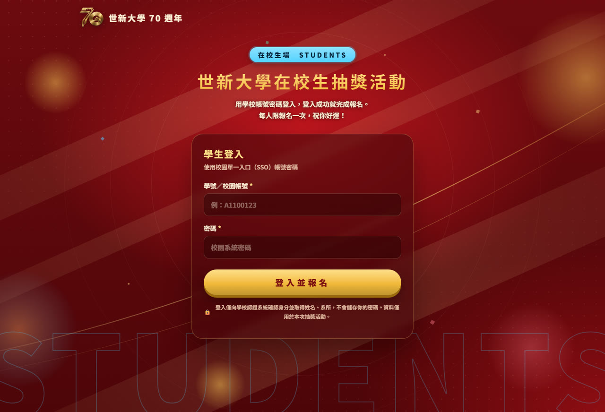
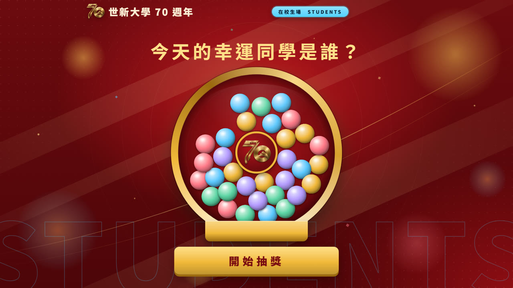
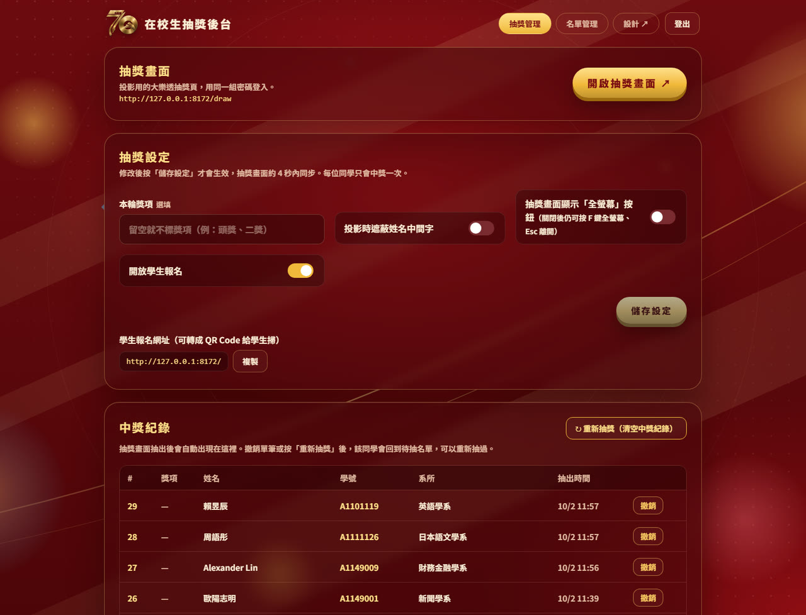
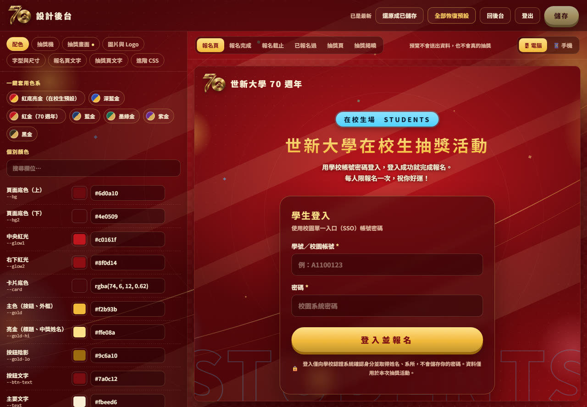

# 世新在校生抽獎系統

在校生輸入學號與姓名、比對後台匯入的在校生名單即完成報名 ＋ 大樂透風格的現場抽獎系統。
視覺採用世新大學 70 週年主視覺，暗紅底、亮金、粗黑體，並以「在校生場 STUDENTS」標籤與浮水印和[校友版](https://github.com/ymlin520/shu-alumni-lottery)區分。

零相依套件，只要有 Node.js 就能跑；資料存在本機單一 JSON 檔。


*抽獎畫面 `/draw`：中獎者的系所先出現，3 秒後姓名以超大字一個字一個字落下，背景持續灑彩帶。
版面、文案、顏色、圖片、動畫秒數全部可在 `/design` 後台調整，不需要改程式。*

```
後台「名單管理」先匯入在校生名單（學號、姓名、系所、電話、Email）
→ 學生掃 QR Code → 輸入學號與姓名 → 系統比對名單，學號或姓名不符會提示錯誤 → 比對成功即完成報名
→ 活動現場投影抽獎畫面 → 按下開始抽獎 → 彩球從畫面外彈跳進場 → 快轉攪拌
→ 減速 → 中獎球滾出 → 畫面中上方先出現系所 → 3 秒後姓名一個字一個字出現
```

---

## 目錄

- [畫面介紹](#畫面介紹)
- [四個頁面](#四個頁面)
- [快速開始](#快速開始)
- [活動當天的流程](#活動當天的流程)
- [後台功能](#後台功能)
- [設計後台](#設計後台)
- [資料與備份](#資料與備份)
- [個資與安全](#個資與安全)
- [環境變數](#環境變數)
- [API 一覽](#api-一覽)
- [檔案結構](#檔案結構)
- [常見問題](#常見問題)

---

## 四個頁面

| 路徑 | 用途 | 需要密碼 |
|---|---|:--:|
| `/` | **報名頁**。學生輸入學號與姓名，比對後台匯入的在校生名單通過即完成報名 | 不需要 |
| `/draw` | **抽獎畫面**。投影用，彩球慢速攪拌後掉出中獎球，畫面中上方先顯示系所、3 秒後姓名超大字一個字一個字出現 | 管理密碼 |
| `/admin` | **後台**。抽獎設定、中獎紀錄、名單管理（含匯入在校生名單）、匯出 CSV | 管理密碼 |
| `/design` | **設計後台**。改前台的顏色、Logo、背景圖、字型、尺寸、所有文字，右側即時預覽 | 管理密碼 |

三個管理頁使用同一組管理密碼。後台與抽獎畫面共用登入（12 小時內有效）；**設計後台需要另外登入**，2 小時後自動登出。

抽獎畫面**不放「後台管理」「登出」按鈕**——投影時誤觸會把畫面切走或登出。要進後台請直接開 `/admin`。右上角的「全螢幕」按鈕**預設也是隱藏的**，可在後台「抽獎設定」打開。

### 抽獎畫面的鍵盤快捷鍵

| 按鍵 | 功能 |
|---|---|
| **空白鍵／Enter／→／PageDown** | 開始抽獎。一般簡報筆的「下一頁」送的就是這幾個鍵，可以站在台上用簡報筆控場 |
| **F** | 全螢幕開關（`Esc` 也可離開） |
| **M** | 音效開關，畫面會短暫顯示目前狀態 |
| **Q 或 A** | 切換到另一場（在校生場 ⇄ 校友場） |

- 抽獎進行中按鍵無效，不會重複抽；在登入密碼欄位打字時不會被攔截。
- 判斷同時看 `e.code` 與 `e.key`，因為部分簡報筆與遠端桌面送出的事件 `e.key` 是空字串。
- Q／A 切換會自動判斷：用本機位址時切對方的本機位址，用 Cloudflare 臨時網址時向伺服器要對方**當下**的臨時網址（臨時網址每次重開都會變，寫死會失效）。

---

## 畫面介紹

### 學生報名頁 `/`



*學生輸入學號與姓名，系統比對後台匯入的在校生名單；學號查無資料或姓名與名單不符都會提示對應的錯誤訊息，比對成功就完成報名。
**不需要密碼**，姓名、系所等資料全部來自後台匯入的名單。*

### 抽獎畫面 `/draw`



*投影用。球槽預設裝滿 32 顆彩球，中央是 70 週年 Logo。按下「開始抽獎」後會先有一顆球從畫面外彈跳進場，
跳進抽獎機才開始攪拌。頂端的「在校生場 STUDENTS」標籤與背景浮水印用來和校友場區分。*

### 抽獎揭曉


*抽獎機變暗，畫面中上方先出現「恭喜抽中」與系所，3 秒後姓名逐字落下，中獎畫面持續灑彩帶。*

### 後台 `/admin`



*抽獎設定、中獎紀錄、名單管理、匯入在校生名單都在這裡。*

### 設計後台 `/design`



*左側修改、右側即時預覽。配色、抽獎機、抽獎畫面、圖片與 Logo、字型、所有文案都能改，不需要動程式。*

---

## 快速開始

需求：[Node.js](https://nodejs.org/) 20 以上（開發環境為 24）。不需要 npm install。

```bash
PORT=8124 node server.js
```

啟動後：

- 網站在 http://localhost:8124
- 首次啟動會自動產生管理密碼，寫在 `admin-password.txt`，終端機也會印出來
- 還沒匯入在校生名單時，報名頁任何學號都會顯示「查無此學號」；請先到 `/admin`「名單管理」匯入名單

Windows 可以直接雙擊 **`啟動.bat`**，它會啟動伺服器（port 8124）並開一條 Cloudflare 臨時通道。

---

## 在校生名單匯入與比對

學生不需要密碼，前台只用**學號＋姓名**比對後台匯入的名單：

- 到 `/admin` →「名單管理」→「匯入在校生名單」，貼上從 Excel／Google 試算表複製的欄位：**學號、姓名、系所、電話、Email**（Tab 或逗號分隔，系所／電話／Email 可留空，第一列若不是學號開頭會自動當標題列略過）。
- 匯入會**整批取代**目前的在校生名單，不影響已經報名的學生。
- 學生在報名頁輸入學號與姓名：
  - 學號不在名單內 → 顯示「查無此學號，請確認輸入正確的學號。」
  - 學號在名單內但姓名對不起來 → 顯示「姓名有誤，請確認輸入與學籍資料相符的姓名。」（比對時會忽略姓名中的空白）
  - 學號與姓名都相符 → 完成報名，系所等資料取自匯入的名單。
- 同一學號重複比對成功不會重複報名，只會更新最後登入時間。

---

## 活動當天的流程

1. **匯入名單＋開放報名**：先到後台「名單管理」匯入在校生名單，再把 `/` 的網址做成 QR Code 發給學生；後台「開放學生報名」要保持開啟。
2. **截止報名**：活動開始前關掉開關，報名頁就會顯示「報名已截止」。
3. **投影**：另一台電腦開 `/draw`，登入後按 **F 鍵**全螢幕（或先到後台把「全螢幕」按鈕打開）。
4. **抽獎**：按「開始抽獎」（或空白鍵／簡報筆），依序是：

   | 階段 | 預設秒數 |
   |---|---|
   | 彩球從畫面外彈跳三次後飛進抽獎機 | 3.4 秒 |
   | 快轉攪拌 | 4 秒 |
   | 減速 | 3.2 秒 |
   | 中獎球慢慢滾出來 | 2.6 秒 |
   | 「恭喜抽中」＋**系所**出現（同名時靠系所區分） | — |
   | 等待後**姓先出現**，再過 3 秒出名字，逐字落下（每字 0.65 秒） | — |

   中獎畫面持續灑彩帶，按鈕在揭曉時移到畫面最下方。所有秒數都能在 `/design` →「抽獎畫面」調整。
   - 中獎者由伺服器以 `crypto.randomInt` 決定，前端只負責播動畫。
   - 每位同學最多中獎一次。
5. **記錄**：中獎名單即時出現在 `/admin` 的「中獎紀錄」，抽錯可單筆「撤銷」。
6. **收尾**：後台「匯出 CSV」下載名單。

---

## 後台功能

### 抽獎設定

| 項目 | 說明 |
|---|---|
| 本輪獎項 | 選填。填了會記在中獎紀錄與 CSV，抽獎畫面不顯示 |
| 投影時遮蔽姓名中間字 | 開啟後中獎姓名顯示為「王○明」 |
| 開放學生報名 | 關閉後報名頁顯示「報名已截止」 |
| 抽獎畫面顯示「全螢幕」按鈕 | **預設關閉**，避免投影時誤觸。關閉後仍可按 F 鍵全螢幕、Esc 離開 |

改完要按 **「儲存設定」** 才生效，抽獎畫面約 4 秒內同步。

### 中獎紀錄

- 抽獎畫面抽出的人會自動出現（後台每 5 秒更新）。
- **撤銷**單筆，或 **↻ 重新抽獎（清空中獎紀錄）** 整批清空，被清掉的人回到待抽名單。

### 在校生名單（`/admin?tab=roster`）

這份是學生報名時比對學號／姓名用的底單，跟下面「報名名單」是兩回事。

- **⭱ 匯入在校生名單**：貼上學號、姓名、系所、電話、Email（Tab 或逗號分隔）整批取代在校生名單；頁面上方會顯示目前已匯入筆數與匯入時間。
- 可搜尋姓名、學號、系所、電話、Email、備註，每頁 50 筆，用「上一頁／下一頁」翻頁。
- 每筆都能按**編輯**修改學號、姓名、系所、電話、Email、備註，或**刪除這筆**；改學號或姓名後，學生要用新的資料才能比對成功。
- 表格會標示每筆是否「已報名」，方便知道哪些人還沒來報名。

### 報名名單（`/admin?tab=list`）

- 統計：已報名、已中獎、待抽、後台補登筆數；可搜尋姓名、學號、系所、Email、編號。
- **＋ 手動新增學生**：現場補登沒有在名單內或比對有問題的學生（學號、姓名、系所、電話、Email），會標記「後台補登」。
- **編輯**／**刪除**單筆；**清空名單**會連續確認兩次（只清空「已報名」名單，不會動到在校生名單）。
- **匯出 CSV**：UTF-8 with BOM，欄位為報名編號、學號、姓名、系所、電話、Email、備註（匯入名單中的其他同行者等資訊）、來源、報名時間、最後登入、中獎獎項、抽出時間。

同一學號重複比對成功不會重複報名，只會更新最後登入時間；報名編號從 `S0001` 起跳。

---

## 設計後台

`/design` 左側修改、右側即時預覽，按「儲存」（或 Ctrl+S）才會套用到正式頁面。

| 分頁 | 內容 |
|---|---|
| 配色 | **一鍵色系**（紅底亮金、深藍金、紅金、藍金、墨綠金、紫金、黑金），以及底色、光暈、卡片、主色、按鈕文字、身分識別色等 15 項 |
| 抽獎機 | 外環三色階、球槽、5 種彩球顏色、中獎球顏色、**彩球數量**（預設裝滿 32 顆）、彩球大小 |
| **抽獎畫面** | **抽獎機大小滑桿**（預設佔畫面高度 56%，可調 25～75%），以及抽獎時的所有尺寸、位置與秒數：中獎姓名字級、系所字級、**姓名離頂端距離**、系所後等多久出姓名、姓名逐字間隔、攪拌時間、彩球轉速、揭曉時抽獎機亮度、揭曉底色濃度、標題字級、按鈕字級等（14 項）。切到這個分頁時，預覽會直接停在「抽獎揭曉」畫面，改了立刻看得到 |
| 圖片與 Logo | **上傳替換**左上角 Logo、抽獎機中心 Logo、分頁圖示、背景裝飾圖（可恢復預設或設為不顯示），以及 Logo 大小、背景透明度 |
| 字型與尺寸 | 內文／標題字型、卡片與按鈕圓角、登記／報名頁標題字級 |
| 報名頁文字 | 身分標籤、浮水印、標題、說明、欄位名稱與提示字、按鈕、個資說明、完成／已報名過／截止畫面（21 項） |
| 抽獎頁文字 | 身分標籤、浮水印、標題、轉盤中心字、按鈕、「恭喜抽中」、未提供系所時的文字等（11 項） |
| 進階 CSS | 自由撰寫 CSS，優先權最高 |

- 預覽另有「**抽獎揭曉**」畫面：不用等攪拌，直接顯示中獎姓名的樣子，方便調整位置與大小。
- 預覽可切換報名頁／報名完成／報名截止／已報名過／抽獎頁，以及電腦／手機寬度；預覽中的送出與抽獎都是假的。
- 上傳的圖片存在 `data/uploads/`（不進版控），限 PNG、JPG、GIF、WebP、SVG、ICO、5 MB 以內；以檔頭判斷格式，SVG 一律以沙盒 CSP 送出。
- 頁面一律透過 `/brand/logo`、`/brand/hub`、`/brand/favicon`、`/brand/bg` 取圖，換圖不用改程式。

---

## 資料與備份

所有資料都在 **`data/db.json`**：

```jsonc
{
  "settings": { "title": "...", "open": true, "maskName": false, "prize": "" },
  "design":   { "vars": {}, "texts": {}, "customCss": "", "assets": {} },
  "roster": [
    { "studentNo": "A1100123", "name": "王小明", "dept": "新聞學系", "phone": "0912345678", "email": "a1100123@mail.shu.edu.tw", "note": "" }
  ],
  "rosterImportedAt": "...",
  "entries": [
    {
      "id": "uuid", "no": "S0001",
      "studentNo": "A1100123", "name": "王小明", "dept": "新聞學系",
      "className": "", "email": "a1100123@mail.shu.edu.tw", "phone": "0912345678", "rosterNote": "",
      "source": "roster",           // roster = 學號／姓名比對名單報名，manual = 後台補登
      "loginCount": 1, "lastLoginAt": "...", "createdAt": "..."
    }
  ],
  "winners": [
    { "id": "uuid", "entryId": "uuid", "no": "S0001", "studentNo": "A1100123",
      "name": "王小明", "dept": "新聞學系", "phone": "0912345678", "rosterNote": "", "prize": "", "drawnAt": "..." }
  ]
}
```

寫檔採「先寫暫存檔再改名」。**備份就是複製這個檔案**。

---

## 個資與安全

這個 repo 是公開的，請注意：

- **`.gitignore` 已排除 `data/`、`admin-password.txt`**：報名資料、在校生名單、管理密碼都不會進版控。
- **學生不輸入密碼**，報名頁只收學號與姓名，拿去跟後台匯入的名單比對；比對用的名單本身也是個資，請勿把 `data/` 上傳到公開的地方。
- 報名每個 IP 每分鐘 10 次、後台登入每分鐘 10 次。
- 管理密碼比對使用 `crypto.timingSafeEqual`；登入以 HttpOnly + SameSite=Strict 的 Cookie 維持 12 小時。
- **設計後台 `/design` 需要單獨登入**：就算已經登入後台或抽獎畫面，進設計後台仍要再輸入一次密碼；設計後台的登入 2 小時後自動失效、不會延長，右上角有「登出」。設計相關 API（讀取／儲存設計、上傳圖片）只接受設計後台的登入。

---

## 環境變數

| 變數 | 預設 | 說明 |
|---|---|---|
| `PORT` | `8124`（校友版是 `8123`，兩邊可同時跑） | 連接埠 |
| `DATA_DIR` | `./data` | 資料夾位置 |
| `ADMIN_PASSWORD` | 讀 `admin-password.txt`，沒有就隨機產生 | 管理密碼 |

---

## API 一覽

前台

| 方法 | 路徑 | 說明 |
|---|---|---|
| `GET` | `/api/status` | 活動標題、是否開放報名、報名人數、在校生名單筆數 |
| `POST` | `/api/login` | 用學號＋姓名比對在校生名單並報名 |

後台（需 `sid` Cookie）

| 方法 | 路徑 | 說明 |
|---|---|---|
| `POST` | `/api/admin/login` / `logout` | 登入、登出 |
| `GET` | `/api/admin/state` | 設定、名單、中獎紀錄、在校生名單筆數 |
| `POST` | `/api/admin/settings` | 儲存獎項、遮蔽姓名、開放報名 |
| `GET` | `/api/admin/draw-info` | 抽獎畫面用的輕量狀態 |
| `POST` | `/api/admin/draw` | 抽出一位中獎者 |
| `DELETE` | `/api/admin/winners/:id` | 撤銷單筆中獎 |
| `POST` | `/api/admin/winners/reset` | 重新抽獎（清空中獎紀錄） |
| `POST` | `/api/admin/roster/import` | 匯入在校生名單（`{records:[{studentNo,name,dept,phone,email,note}]}`，整批取代） |
| `GET` | `/api/admin/roster/list?q=&limit=&offset=` | 搜尋／分頁瀏覽在校生名單 |
| `PUT` `DELETE` | `/api/admin/roster/:studentNo` | 修改、刪除單筆在校生名單資料 |
| `POST` | `/api/admin/entries` | 手動新增學生 |
| `GET` `PUT` `DELETE` | `/api/admin/entries/:id` | 讀取、修改、刪除 |
| `POST` | `/api/admin/entries/reset` | 清空名單 |
| `GET` | `/api/admin/export.csv` | 匯出 CSV |
| `GET` `POST` | `/api/admin/design` | 讀取／儲存設計設定 |
| `POST` | `/api/admin/upload?slot=logo\|hub\|favicon\|bg` | 上傳圖片 |

圖片（不需登入）：`GET /brand/:slot`（加 `?default` 取預設圖）、`GET /uploads/:file`。

---

## 檔案結構

```
server.js                伺服器：路由、API、資料存取、設計注入、上傳
design-defaults.js       設計後台的預設顏色、尺寸、文字、圖片
public/
  index.html             報名頁（學號＋姓名比對在校生名單）
  draw.html              抽獎畫面（彩球物理動畫與兩段式揭曉）
  admin.html             後台（含匯入在校生名單）
  design.html            設計後台
  assets/                共用樣式、套用設計的腳本、Logo、背景圖
啟動.bat                 Windows 一鍵啟動：伺服器 ＋ Cloudflare 臨時網址
data/                    ← 不進版控（db.json、uploads/）
admin-password.txt       ← 不進版控

舊版 SSO 介接留存但目前未使用（已改為學號／姓名比對在校生名單）：
sso.js、sso-config.example.json、sso-config.json、SSO設定說明.txt
```

---

## 常見問題

**學生說學號姓名都對卻報名失敗？**
看伺服器 log 的 `[報名失敗]` 那行。常見原因是在校生名單還沒匯入、名單裡的姓名跟學生輸入的不完全一樣（例如中間多一個字、同音字打錯），或學號打錯／大小寫被系統自動轉大寫後對不上。可以到後台「名單管理」搜尋該學號確認名單裡存的姓名是什麼。

**同一個學號在名單裡出現兩次怎麼辦？**
匯入時同學號會互相覆蓋，只留最後一筆；如果來源試算表是「一列填兩個學號」（例如一人代填同行者），只有該列的姓名會對到其中一個學號，其餘學號要手動在「名單管理」更正或用「＋ 手動新增學生」補登。

**重新報名會不會重複報名？**
不會，以學號判斷，重複比對成功只更新最後登入時間，畫面顯示「你已經報名過了」。

**手動編輯 db.json 要注意什麼？**
伺服器啟動時會把檔案讀進記憶體，必須先停止伺服器再編輯，否則會被覆寫。

**改了程式沒反應？**
`public/` 下的頁面每次請求都重新讀檔，重新整理即可；改 `server.js`、`design-defaults.js` 要重新啟動。
